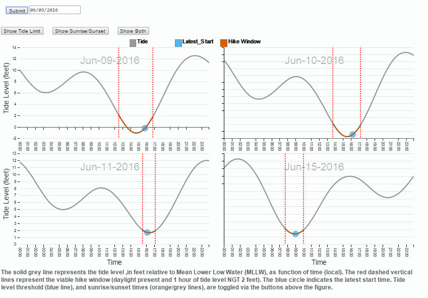
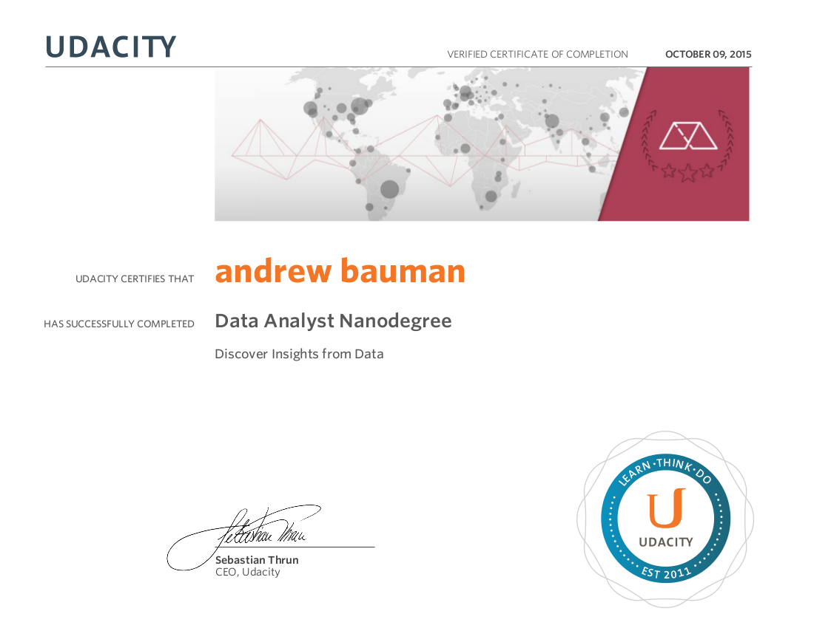

# Data Analyst Project Portfolio

The Udacity Data Analyst Nanodegree requires a pre-requisite familiarity and experience in statistics and computer programming, followed by completion of several courses that build the foundations of data science and analysis.

## Make An Effective Data Visualization

**Skills Developed:** HTML, CSS, SVG, DIMPLE.JS, D3.JS, DESIGN PRINCIPLES, VISUAL ENCODINGS 

During this course we learned principles and tools (dimple.js, d3.js) for creating an effective data visualization. For my project I wrangled and transformed tide data in python, then used dimple, d3, moment, and vanilla javascript to create an interactive visualization designed to help the user determine when to attempt a low tide hike between two parks in North Seattle. View a live version of my final project visualization here: [Seattalytics](http://seattalytics.com).  Source code and additonal project details are available at the project [Github Repository](https://github.com/baumanab/seattle_tides).

## Identifying Fraud from Enron Email

**Skills Developed:** PYTHON, SCIKIT-LEARN, NATURAL LANGUAGE PROCESSING, FEATURE SELECTION, VERIFYING MACHINE LEARNING PERFORMANCE
This project focused on developing a machine learning algorithm for identifying fraud, using the Enron data set. While this was not my first exposure to machine learning, it was the first exposure to sklearn. I enjoyed building pipelines for feature selection and tuning as well as balancing recall and precision on a sparse data set.  Source code and additional project details are available at the project [Github Repository](https://github.com/baumanab/udacity_intro_machinelearning_project).

## Explore and Summarize Data

**Skills Devloped:** RSTUDIO, R PACKAGES, PLOTTING IN R, EXPLORATORY DATA ANALYSIS TECHNIQUES 
For this project I used R to perform exploratory data analysis (EDA) on a Washington State school vaccine exemption data set (2011, 2012, 2013) provided by the WA Department of Health (DOH). The data required extensive cleaning and wrangling, prior to exploration. This was my first experience cleaning data in R, it was challenging, but enjoyable. My favorite part of this experience was learning about "tidy" data and using specific R packages to tidy the data (dplyr, tidyR etc). Another great aspect was learning how to use RStudio to create .MD files and knit them into html for dissemination.  Source code and additional project details are available at the project [Github Repository](https://github.com/baumanab/EDA_R_Udacity).

## Analyzing the New York Subway Dataset

**Skills Developed:** PYTHON, NUMPY, PANDAS, GGPLOT, LINEAR REGRESSION, SQL QUERIES, PANDASQL 
During the course we analyzed NYC subway data from May 2011. We wrangled and interrogated the data and received an introduction to I/O methods. Methods and tools of interrogation included: - SQL Queries - Linear Regression/Gradient Descent - Map Reduce - PANDAS - iPython Notebook I really enjoyed integrating a variety of computational tools to answer a basic question. Source code and additional project details are available at the project [Github Repository](https://github.com/baumanab/IntroDSProject).

## Data Wrangle OpenstreetMaps Data

**Skills Developed:** PYTHON, MONGODB, DATA VERIFICATION, DATA CLEANING 
During this course and related project we learned how to acquire, audit, wrangle, and clean data, as well as how to reshape the data for MongoDB. Ultimately we used these skills to clean and explore OpenstreetMaps data. The entire concept of programmatic data wrangling was new to me, as was the use of a nosql database (previous experience with relational). It was intimidating at first but now I have to ability to take command of the data sets I'm interested in exploring. It has been a useful skill for subsequent projects and for the computational aspects of my mass proteomics and mass spectrometry work. Source code and additional project details are available at the project [Github Repository](https://github.com/baumanab/udacity_mongo_github).

## Certificate of Completion

